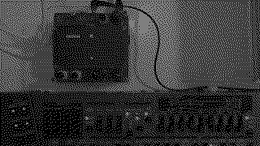

# Paranibbles

Paranibbles for paradiddles.

Paradiddles are drumming patterns, e.g. `RLRR LRLL`. Nibbles are half a byte, 4 bits. With *paranibbles* you set the first four bits as a number, and the script extends this to a full byte.

## Requirements

- norns
- MIDI device, or n.b.

### Documentation

- encoder 1: set the first nibble
- encoder 2: rotate accent pattern
- encoder 3: change accent force

Accent force is the difference between accented and non-accented notes, deviating up and down from mid-velocity respectively.

Set where to send and what to send in params.

### inspiration

Inspired by this video from the ever awesome Oskar https://www.youtube.com/watch?v=EZBpxkxJg0o

### installation

`;install https://github.com/xmacex/paranibbles`
